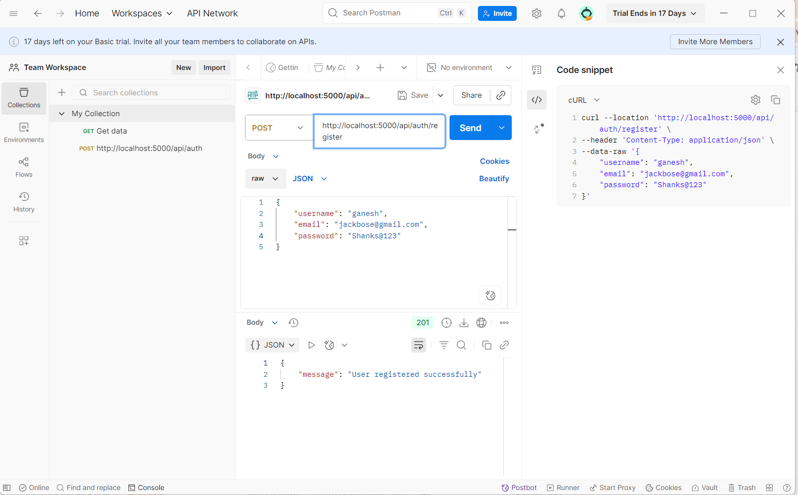
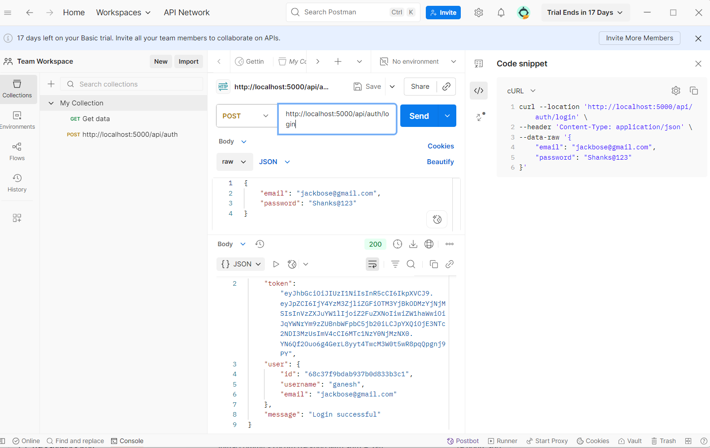
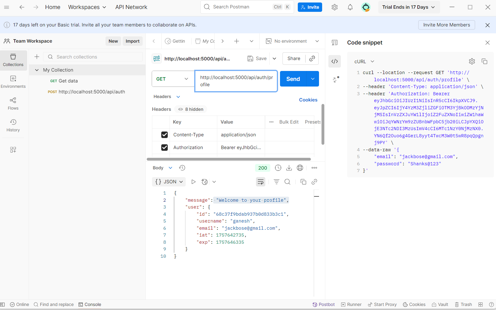
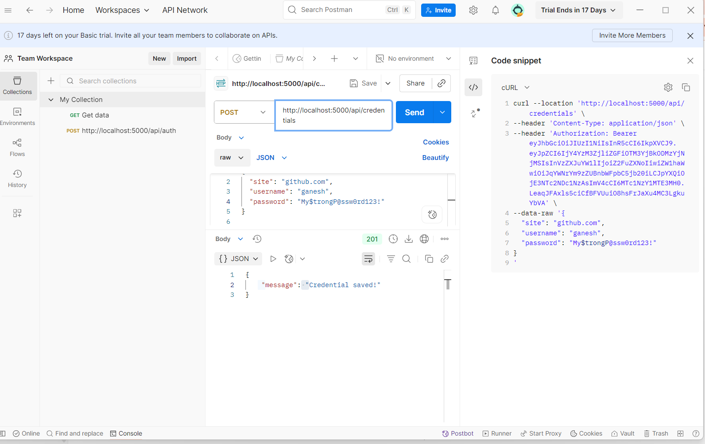
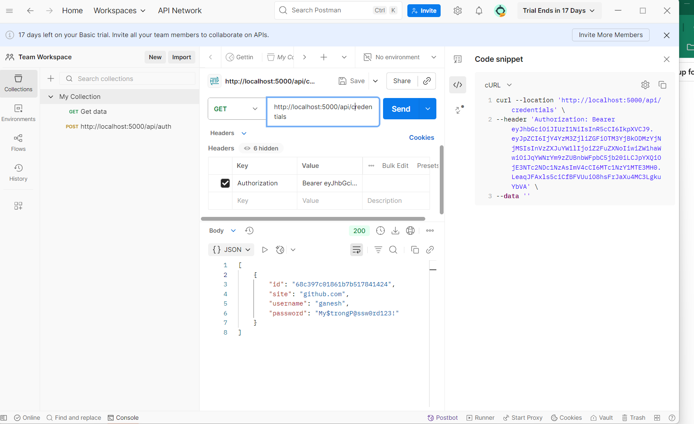
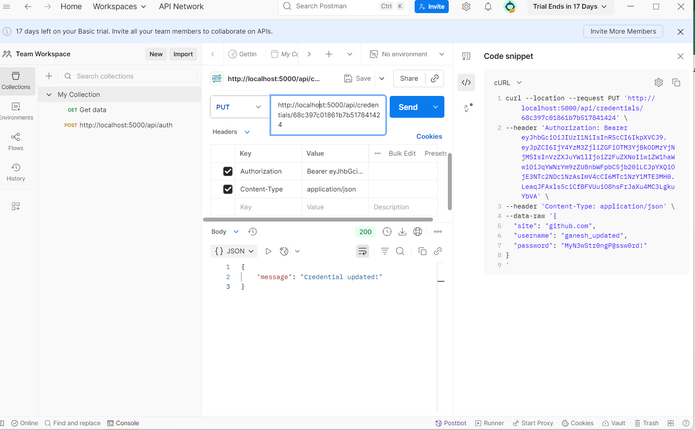
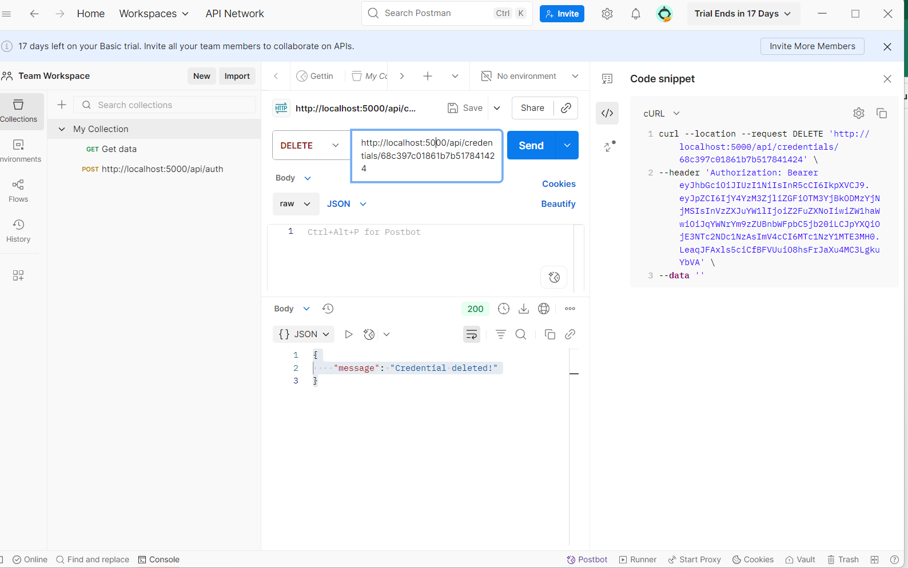
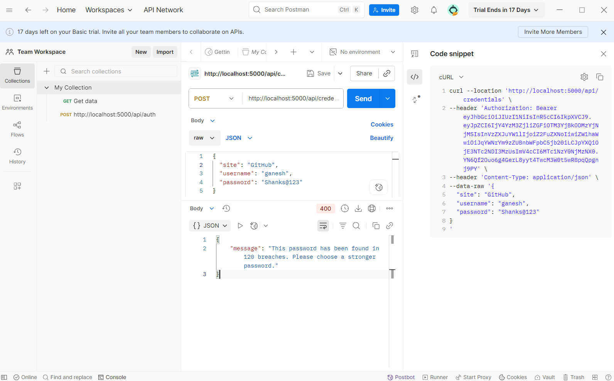
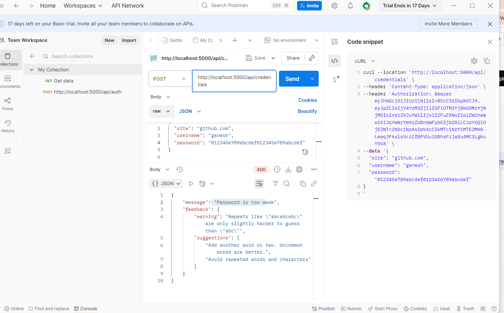

# 🔐 CipherSafe  

A secure credential manager built with Node.js, featuring JWT authentication, 2FA, AES encryption, and breach detection.  

---

## ✨ Features  

- ✅ User Authentication (Register/Login)  
- ✅ JWT-based session security  
- ✅ CRUD operations for credentials  
- ✅ AES encryption for sensitive data  
- ✅ Breach detection using [HIBP API](https://haveibeenpwned.com/)  
- ✅ Password strength meter  
- ✅ Two-Factor Authentication (Time-based TOTP) for extra security

---

## 🛠 Tech Stack  

- **Backend**: Node.js, Express  
- **Database**: MongoDB (or compatible)  
- **Auth & Security**: JSON Web Tokens (JWT), AES Encryption, 2FA  
- **API Integration**: HIBP (Have I Been Pwned) API  

---

## ⚡ Getting Started  

### Prerequisites  
- Node.js installed  
- MongoDB running (local or cloud)  
- [Postman](https://www.postman.com/) (optional, for testing APIs)  

### Installation  

```bash
# Clone repository
git clone https://github.com/YourUsername/ciphersafe.git
cd ciphersafe

# Install dependencies
npm install

# Create .env file and add your environment variables
# Example:
# MONGO_URI=mongodb://localhost:27017/ciphersafe
# JWT_SECRET=yourSecretKey
# HIBP_API_KEY=yourApiKey

# Start the server
npm start

🗄 Database Schema (Example)

User Schema

{
  username: String,
  email: String,
  password: String,   // hashed
  twoFactorEnabled: Boolean,
  twoFactorSecret: String
}


Credential Schema

{
  userId: ObjectId,
  service: String,
  username: String,
  password: String,   // AES encrypted
  createdAt: Date
}


## 📌 API Endpoints

### 🔑 Auth
| Method | Endpoint            | Description             | Body Example                                                                 |
|--------|---------------------|-------------------------|------------------------------------------------------------------------------|
| POST   |  /api/auth/register | Register new user       | ```json { "username": "testuser", "email": "test@example.com", "password": "StrongPass123!" } ``` |
| POST   |  /api/auth/login    | Login & get JWT token   | ```json { "username": "testuser", "password": "StrongPass123!" } ``` |

---

### 📂 Credentials
| Method | Endpoint                  | Description                         | Body Example                                                                 |
|--------|---------------------------|-------------------------------------|------------------------------------------------------------------------------|
| GET    |  /api/credentials         | Get all saved credentials (JWT req) | -                                                                            |
| POST   |  /api/credentials         | Add new credential                  | ```json { "service": "gmail", "username": "myemail@gmail.com", "password": "MyPass123!" } ``` |
| PUT    |  /api/credentials/:id     | Update credential by ID             | ```json { "username": "newmail@gmail.com", "password": "NewPass456!" } ```   |
| DELETE |  /api/credentials/:id     | Delete credential by ID             | -                                                                            |

---

### 🛡️ Security Features
| Method | Endpoint                  | Description                                      | Body Example                                  |
|--------|---------------------------|--------------------------------------------------|-----------------------------------------------|
| GET    |  /api/auth/2fa/setup           | Setup 2FA (get QR/secret)                   | -                                             |
| POST   |  /api/auth/2fa/verify          | Verify TOTP code                            | ```json { "token": "123456" } ```             |
| POST   |  /api/auth/2fa/login           | Login with 2FA after password auth          | ```json { "username": "test", "password": "StrongPass123!", "token": "123456" } ``` |


🔒 Extra Features

AES Encryption → All stored credentials are encrypted before saving in DB.

2FA → Time-based One-Time Password (TOTP) 2FA with Google Authenticator, Authy, etc.

HIBP Integration → Checks if a password has appeared in known data breaches.

Password Strength Meter → Ensures users set strong, secure passwords.


## 🔥 API Workflow (Postman Tested Screenshots)

Below are the tested API endpoints with sample screenshots and explanations :

## Screenshots
📂 **screenshots/**  
__This folder contains all Postman testing screenshots for API demonstration.__


## 📸 API Demonstration  

### 1. 📝 User Registration  
Registers a new user with `username`, `email`, and `password`. Returns a success message.  
  

---

### 2. 🔑 User Login  
Authenticates the user with credentials. Returns a **JWT token** on success.  
  

---

### 3. 🎫 JWT Token  
The JWT token is required for all protected routes. Save it in headers as:  
Authorization: Bearer <your_jwt_token>
  


### 4. 👤 Profile   
Fetches the user’s profile information using the JWT.  
  

---

### 5. ➕ Create Credential  
Saves a new credential (service, username, password). The password is **AES encrypted** before storage.  
  

---

### 6. 📂 Get Credentials  
Fetches all saved credentials for the logged-in user.  
  

---

### 7. ✏️ Update Credential  
Updates an existing credential’s password or username.  
  

---

### 8. 🗑️ Delete Credential  
Deletes a credential by its unique ID.  
  

---

### 9. 🔍 Password Breach Check  
Checks if a password/email has appeared in known data breaches using the **HIBP API**.  
  

---

### 10. 🛡️ Password Strength  
Evaluates password strength to ensure users choose strong, secure passwords.  
  

---

### 11. 🔐 AES Encryption  
- **Encrypt**: Plaintext password is encrypted before saving to MongoDB.
     

- **Decrypt**: Credentials are decrypted only when fetched back by the user.
     
  
---

### 12. 🔑 Two-Factor Authentication (2FA)  
- **Setup**: Generates a secret or QR code for Google Authenticator/Authy.
   

- **Verify**: User submits the 6-digit TOTP code for verification.
   
 
- **Login with 2FA**: After password login, user must provide 2FA code for final access.
     

---

## 🚀 Deployment  

The project is live!  

🔗 **Base URL**: [https://ciphersafe-96l7.onrender.com](https://ciphersafe-96l7.onrender.com)  

### Example Endpoints  
- `POST /api/auth/register` → Register a new user  
- `POST /api/auth/login` → Login user & get JWT  
- `GET /api/credentials` → Get all credentials (JWT required)  


